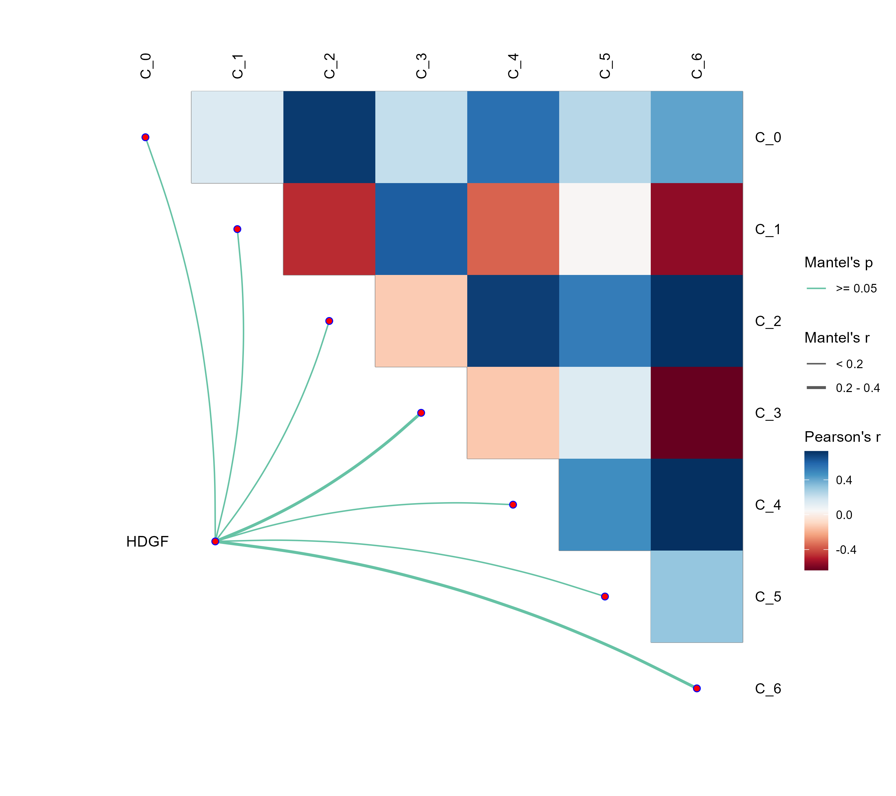
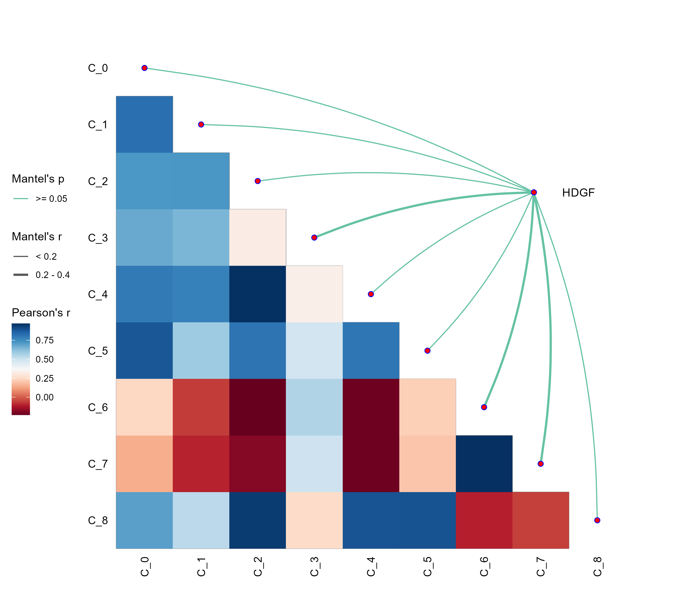

# Cytfly: 单细胞通讯分析工具

Cytfly是一个用于分析单细胞RNA-seq数据中基因表达与细胞通讯关系的R包。它能够根据目标基因的表达水平将细胞分为高表达和低表达两组，分别进行CellChat分析，并使用linkET可视化通讯网络的差异。

## 功能特点

- 根据目标基因表达量自动分组
- 运行CellChat进行细胞通讯分析
- 提取、对齐和对称化通讯概率矩阵
- 使用linkET绘制高质量的细胞通讯热力图
- 支持Seurat 4和Seurat 5
- 提供完整的错误处理和模拟数据备份

## 安装

```R
# 安装开发版本
devtools::install_github("Zac-lzh/Cytfly")

```

## 依赖包

- Seurat
- CellChat
- linkET
- dplyr
- tidyr
- future
- patchwork
- RColorBrewer
- tibble

## 使用方法

```R
library(Cytfly)

# 加载Seurat对象
seurat_obj <- readRDS("path/to/seurat_object.rds")

# 运行Cytfly分析
result <- Cytfly(seurat_obj, 
                target_gene = "Hoxc4", 
                species = "mouse", 
                annotation_col = "seurat_clusters", 
                output_dir = "output")
```

## 参数说明

- `seurat_obj`: Seurat对象
- `target_gene`: 目标基因名称
- `species`: 物种，可选值为"human"或"mouse"
- `group_by`: 分组方式，默认为"auto"（根据中位数自动分组）
- `annotation_col`: 用于细胞类型注释的列名，默认为"seurat_clusters"
- `output_dir`: 输出目录路径

## 输出结果

- `high_expression_communication.png`: 高表达组的细胞通讯热力图
- `low_expression_communication.png`: 低表达组的细胞通讯热力图
- `combined_communication.png`: 组合图（可选）
- `mantel_results.csv`: Mantel测试结果

## 可视化说明

Cytfly使用linkET包绘制细胞通讯热力图，具有以下特点：

- 下三角热力图
- RdBu配色方案
- Mantel耦合线（如果有结果）
- 显著性标记
- 基因名称注释

### 分析结果示例

| 高表达组 (High) | 低表达组 (Low) |
| :---: | :---: |
|  |  |

## 故障排除

如果遇到问题，请检查：

1. 目标基因是否存在于表达矩阵中
2. 细胞类型注释列是否正确
3. 所有依赖包是否已正确安装
4. Seurat对象是否包含足够的细胞

## 版本历史

- v0.1.0: 初始版本
- v0.1.1: 修复Seurat 5兼容性问题
- v0.1.2: 更新linkET绘图功能

## 作者

[Your Name] [Your Email]

## 许可证

MIT License